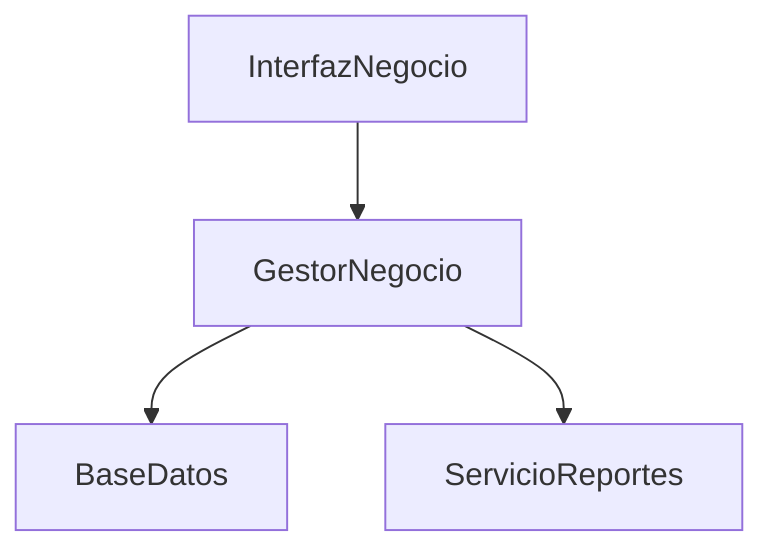

# 🚀 Sistema de Gestión para Emprendedores

## 🎯 Contexto y Problema

Los emprendedores enfrentan múltiples desafíos al iniciar y gestionar sus negocios. La falta de herramientas integradas dificulta el seguimiento de ventas, inventario y finanzas, lo que puede afectar la toma de decisiones y el crecimiento del negocio.

### ⚠️ Desafíos del Proyecto

| Desafío | Descripción |
|---------|-------------|
| Ventas | Seguimiento de ventas y clientes |
| Inventario | Control de productos y stock |
| Finanzas | Gestión de ingresos y gastos |
| Reportes | Generación de informes y análisis |
| Usuarios | Gestión de roles y permisos |

## 🎯 Objetivo

Diseñar un sistema integral que permita a los emprendedores gestionar sus negocios de manera eficiente, facilitando el seguimiento de ventas, inventario y finanzas.

## 📋 Escenario

Se debe desarrollar un sistema con las siguientes funcionalidades principales:

1. **💰 Gestión de Ventas**  
   Registrar y dar seguimiento a las ventas.

2. **📦 Control de Inventario**  
   Gestionar productos y niveles de stock.

3. **💹 Finanzas**  
   Administrar ingresos, gastos y flujo de caja.

4. **📊 Reportes**  
   Generar informes y análisis de negocio.

5. **👥 Gestión de Usuarios**  
   Administrar roles y permisos.

## 📝 Tareas

### Parte 1: Análisis (M3)

#### 1. Diagrama de Casos de Uso
- [ ] Crear diagrama UML de casos de uso para las funcionalidades principales
- [ ] Incluir actores (Emprendedor, Vendedor, Contador)
- [ ] Seguir estándares de notación UML

#### 2. Diagrama de Clases
- [ ] Identificar y definir clases con estereotipos (Borde, Entidad, Control)
- [ ] Clases requeridas:
  - `Venta`
  - `Producto`
  - `Cliente`
  - `Usuario`
  - `Finanza`
  - `GestorNegocio`
- [ ] Incluir atributos y métodos
- [ ] Definir asociaciones entre clases

#### 3. Diagramas de Interacción
- [ ] Diagrama de secuencia para "Registrar una Venta"
- [ ] Diagrama de colaboración para el mismo caso

#### 4. Tarjetas CRC
Para cada clase:
- [ ] Nombre
- [ ] Descripción
- [ ] Estereotipo
- [ ] Atributos
- [ ] Responsabilidades
- [ ] Colaboraciones

### Parte 2: Diseño (Módulo 3 - Lectura 3)

#### 1. Diagrama de Clases Refinado
- [ ] Tipos de datos específicos
- [ ] Firmas de métodos
- [ ] Nuevas clases o relaciones
- [ ] Consideraciones de rendimiento

#### 2. Decisiones de Diseño
- [ ] Estrategia de gestión de inventario
- [ ] Manejo de finanzas
- [ ] Sistema de reportes

### Parte 3: Implementación (Módulo 4 - Lecturas 1, 2)

#### 1. Diagrama de Componentes
Componentes principales:

#### 2. Diagrama de Despliegue
Nodos:
- [ ] Servidor Web
- [ ] Servidor de Aplicación
- [ ] Servidor de Base de Datos
- [ ] Servidor de Reportes

### Parte 4: Pruebas (Módulo 4 - Lecturas 3, 4)

#### 1. Plan de Pruebas
Niveles:
- [ ] Unitaria
- [ ] Integración
- [ ] Sistema
- [ ] Aceptación

Casos de prueba requeridos:
1. ✅ Registro de venta exitoso
2. ❌ Intento de venta sin stock
3. ⚠️ Actualización de inventario
4. 🚫 Acceso no autorizado

#### 2. Estrategia de Pruebas
- [ ] Frecuencia de ejecución
- [ ] Herramientas
- [ ] Criterios de finalización
- [ ] Recursos necesarios

## 📦 Entregables
1. Archivo .puml con el código de los diagramas
2. Imagen .png de cada diagrama generado
3. Explicación de los estados posibles de una venta y sus transiciones

## 📌 Notas
- Fecha de entrega: [Fecha a definir]
- Puntos: 15

---
*Nota: Este documento está en formato Markdown y puede ser visualizado en cualquier editor que soporte Markdown para una mejor experiencia de lectura.*