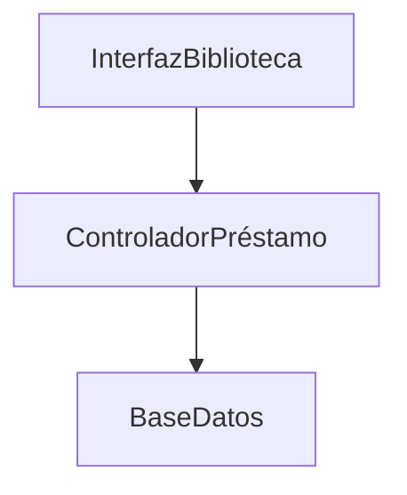

# 📚 Sistema de Gestión de Biblioteca

## 🎯 Contexto y Problema

La Biblioteca Universitaria enfrenta serios problemas en la gestión de sus servicios debido a un sistema manual obsoleto basado en registros en papel y planillas Excel. Los estudiantes reportan demoras significativas al intentar prestar libros, ya que el personal debe verificar manualmente la validez de las credenciales y el historial de préstamos, lo que genera colas y frustración. Además, los errores humanos son frecuentes: libros marcados como disponibles aparecen prestados, y los registros de devolución a veces se pierden, causando multas injustas a los estudiantes.

El proceso de registro de nuevos estudiantes es igualmente ineficiente. Los bibliotecarios dedican horas a ingresar datos manualmente, y las credenciales físicas se deterioran o se extravían, complicando la identificación de los usuarios. La falta de un sistema centralizado también impide un seguimiento adecuado del inventario de libros, lo que resulta en discrepancias entre los registros y la disponibilidad real.

### ⚠️ Desafíos del Proyecto

| Desafío | Descripción |
|---------|-------------|
| Requerimientos | No están completamente claros |
| Usuarios | Bibliotecarios no familiarizados con sistemas digitales |
| Escalabilidad | Sistema debe soportar crecimiento |
| Integración | Conexión con base de datos MySQL existente |
| Robustez | Manejo de errores y excepciones |
| Tiempo | Plazos ajustados para el lanzamiento |

## 🎯 Objetivo

Aplicar los conceptos de los Módulos 3 y 4 para analizar, diseñar, implementar y probar un sistema simplificado de gestión de biblioteca. El ejercicio abarca la creación de diagramas UML, diseño de clases, modelado de implementación y planificación de pruebas.

## 📋 Escenario

Se debe desarrollar un sistema para gestionar una biblioteca universitaria. El sistema debe manejar los siguientes casos de uso:

1. **📖 Prestar un Libro**  
   Un estudiante puede prestar un libro si tiene una credencial válida y menos de tres libros prestados.

2. **📚 Devolver un Libro**  
   Un estudiante puede devolver un libro prestado, actualizando los registros del sistema.

3. **👤 Registrar un Nuevo Estudiante**  
   El bibliotecario puede registrar a un nuevo estudiante en el sistema, creando una credencial de biblioteca.

## 📝 Tareas

### Parte 1: Análisis (M3)

#### 1. Diagrama de Casos de Uso
- [ ] Crear diagrama UML de casos de uso para los tres casos
- [ ] Incluir actores (Estudiante y Bibliotecario)
- [ ] Seguir estándares de notación UML (Módulo 3, Lectura 4)

#### 2. Diagrama de Clases
- [ ] Identificar y definir clases con estereotipos (Borde, Entidad, Control)
- [ ] Clases requeridas:
  - `Estudiante`
  - `Credencial`
  - `Libro`
  - `Préstamo`
  - `ControladorPréstamo`
  - `InterfazBiblioteca`
- [ ] Incluir atributos y métodos
- [ ] Definir asociaciones entre clases

#### 3. Diagramas de Interacción
- [ ] Diagrama de secuencia para "Prestar un Libro"
- [ ] Diagrama de colaboración para el mismo caso

#### 4. Tarjetas CRC
Para cada clase:
- [ ] Nombre
- [ ] Descripción
- [ ] Estereotipo
- [ ] Atributos
- [ ] Responsabilidades
- [ ] Colaboraciones

### Parte 2: Diseño (Módulo 3 - Lectura 3)

#### 1. Diagrama de Clases Refinado
- [ ] Tipos de datos específicos
- [ ] Firmas de métodos
- [ ] Nuevas clases o relaciones
- [ ] Consideraciones de rendimiento

#### 2. Decisiones de Diseño
- [ ] Elección de base de datos
- [ ] Componentes reutilizables
- [ ] Manejo de excepciones

### Parte 3: Implementación (Módulo 4 - Lecturas 1, 2)

#### 1. Diagrama de Componentes
Componentes principales:

#### 2. Diagrama de Despliegue
Nodos:
- [ ] PC Cliente
- [ ] Servidor de Aplicaciones
- [ ] Servidor de Base de Datos

### Parte 4: Pruebas (Módulo 4 - Lecturas 3, 4)

#### 1. Plan de Pruebas
Niveles:
- [ ] Unitaria
- [ ] Integración
- [ ] Sistema
- [ ] Aceptación

Casos de prueba requeridos:
1. ✅ Entrada válida
2. ❌ Entrada no válida
3. ⚠️ Caso límite
4. 🚫 Caso de error

#### 2. Estrategia de Pruebas
- [ ] Frecuencia de ejecución
- [ ] Herramientas
- [ ] Criterios de finalización
- [ ] Recursos necesarios

---
*Nota: Este documento está en formato Markdown y puede ser visualizado en cualquier editor que soporte Markdown para una mejor experiencia de lectura.* 