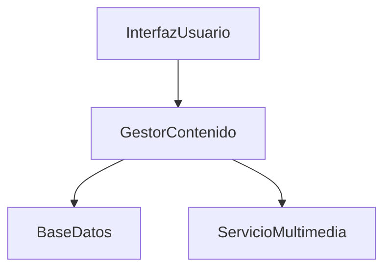

# 🌐 Sistema de Red Social

## 🎯 Contexto y Problema

Las redes sociales se han convertido en una parte fundamental de la interacción social moderna. Sin embargo, muchas plataformas existentes no logran ofrecer una experiencia personalizada y eficiente para los usuarios. Los problemas comunes incluyen feeds desorganizados, dificultad para gestionar conexiones, y limitaciones en la interacción con el contenido.

### ⚠️ Desafíos del Proyecto

| Desafío | Descripción |
|---------|-------------|
| Personalización | Crear un feed de noticias relevante para cada usuario |
| Escalabilidad | Manejar grandes volúmenes de usuarios y contenido |
| Interacción | Facilitar la interacción entre usuarios |
| Rendimiento | Optimizar la carga y visualización de contenido |
| Privacidad | Gestionar adecuadamente la información personal |

## 🎯 Objetivo

Diseñar un sistema de red social que permita a los usuarios crear perfiles, publicar contenido y establecer conexiones con otros usuarios de manera eficiente y personalizada.

## 📋 Escenario

Se debe desarrollar un sistema de red social con las siguientes funcionalidades principales:

1. **👤 Gestión de Perfiles**  
   Los usuarios pueden crear y gestionar sus perfiles con información personal básica.

2. **📝 Publicación de Contenido**  
   Los usuarios pueden publicar posts con texto e imágenes.

3. **🔗 Conexiones Sociales**  
   Los usuarios pueden seguir a otros usuarios y establecer conexiones.

4. **💬 Interacción**  
   Los usuarios pueden dar "me gusta" y comentar en posts.

5. **📰 Feed Personalizado**  
   El sistema mantiene un feed de noticias personalizado para cada usuario.

## 📝 Tareas

### Parte 1: Análisis (M3)

#### 1. Diagrama de Casos de Uso
- [ ] Crear diagrama UML de casos de uso para las funcionalidades principales
- [ ] Incluir actores (Usuario, Sistema)
- [ ] Seguir estándares de notación UML

#### 2. Diagrama de Clases
- [ ] Identificar y definir clases con estereotipos (Borde, Entidad, Control)
- [ ] Clases requeridas:
  - `Usuario`
  - `Perfil`
  - `Post`
  - `Comentario`
  - `Conexion`
  - `FeedManager`
- [ ] Incluir atributos y métodos
- [ ] Definir asociaciones entre clases

#### 3. Diagramas de Interacción
- [ ] Diagrama de secuencia para "Publicar un Post"
- [ ] Diagrama de colaboración para el mismo caso

#### 4. Tarjetas CRC
Para cada clase:
- [ ] Nombre
- [ ] Descripción
- [ ] Estereotipo
- [ ] Atributos
- [ ] Responsabilidades
- [ ] Colaboraciones

### Parte 2: Diseño (Módulo 3 - Lectura 3)

#### 1. Diagrama de Clases Refinado
- [ ] Tipos de datos específicos
- [ ] Firmas de métodos
- [ ] Nuevas clases o relaciones
- [ ] Consideraciones de rendimiento

#### 2. Decisiones de Diseño
- [ ] Almacenamiento de contenido multimedia
- [ ] Algoritmo de feed personalizado
- [ ] Manejo de notificaciones

### Parte 3: Implementación (Módulo 4 - Lecturas 1, 2)

#### 1. Diagrama de Componentes
Componentes principales:

#### 2. Diagrama de Despliegue
Nodos:
- [ ] Servidor Web
- [ ] Servidor de Aplicación
- [ ] Servidor de Base de Datos
- [ ] Servidor de Almacenamiento

### Parte 4: Pruebas (Módulo 4 - Lecturas 3, 4)

#### 1. Plan de Pruebas
Niveles:
- [ ] Unitaria
- [ ] Integración
- [ ] Sistema
- [ ] Aceptación

Casos de prueba requeridos:
1. ✅ Publicación exitosa de post
2. ❌ Intento de publicación sin contenido
3. ⚠️ Publicación con contenido muy largo
4. 🚫 Intento de acceso no autorizado

#### 2. Estrategia de Pruebas
- [ ] Frecuencia de ejecución
- [ ] Herramientas
- [ ] Criterios de finalización
- [ ] Recursos necesarios

## 📦 Entregables
1. Archivo .puml con el código de los diagramas
2. Imagen .png de cada diagrama generado
3. Breve explicación de las clases y sus relaciones

## 📌 Notas
- Fecha de entrega: [Fecha a definir]
- Puntos: 15

---
*Nota: Este documento está en formato Markdown y puede ser visualizado en cualquier editor que soporte Markdown para una mejor experiencia de lectura.* 