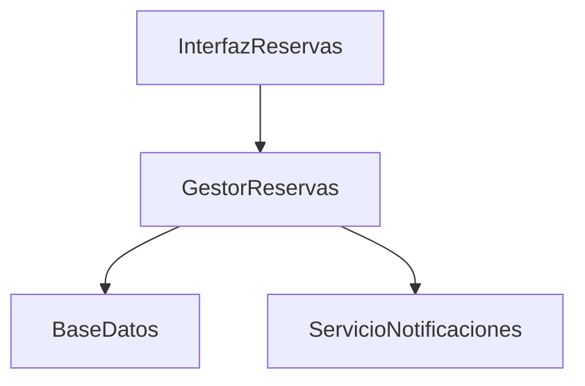

# 🍽️ Sistema de Reservas de Restaurante

## 🎯 Contexto y Problema

Los restaurantes modernos enfrentan desafíos significativos en la gestión de sus reservas. El sistema manual actual basado en llamadas telefónicas y anotaciones en papel resulta ineficiente y propenso a errores. Los clientes experimentan largas esperas para confirmar disponibilidad, y el personal del restaurante tiene dificultades para gestionar múltiples reservas simultáneamente.

### ⚠️ Desafíos del Proyecto

| Desafío | Descripción |
|---------|-------------|
| Gestión de Mesas | Manejar diferentes tipos y estados de mesas |
| Disponibilidad | Verificar y actualizar disponibilidad en tiempo real |
| Reservas | Procesar y gestionar múltiples reservas simultáneas |
| Modificaciones | Permitir cambios y cancelaciones de reservas |
| Historial | Mantener un registro de reservas por cliente |

## 🎯 Objetivo

Diseñar un sistema de gestión de reservas para un restaurante que permita administrar mesas, clientes y reservas de manera eficiente y confiable.

## 📋 Escenario

Se debe desarrollar un sistema de reservas con las siguientes funcionalidades principales:

1. **🪑 Gestión de Mesas**  
   El restaurante tiene diferentes tipos de mesas (2, 4, 6 y 8 personas).

2. **📅 Reservas**  
   Los clientes pueden hacer reservas para una fecha y hora específica.

3. **✅ Verificación**  
   El sistema debe verificar la disponibilidad de mesas.

4. **🔄 Estado de Mesas**  
   Gestionar el estado de las mesas (libre, reservada, ocupada).

5. **📝 Modificaciones**  
   Permitir cancelar o modificar reservas existentes.

6. **📊 Historial**  
   Mantener un historial de reservas por cliente.

## 📝 Tareas

### Parte 1: Análisis (M3)

#### 1. Diagrama de Casos de Uso
- [ ] Crear diagrama UML de casos de uso para las funcionalidades principales
- [ ] Incluir actores (Cliente, Administrador)
- [ ] Seguir estándares de notación UML

#### 2. Diagrama de Clases
- [ ] Identificar y definir clases con estereotipos (Borde, Entidad, Control)
- [ ] Clases requeridas:
  - `Mesa`
  - `Reserva`
  - `Cliente`
  - `Restaurante`
  - `GestorReservas`
  - `InterfazReservas`
- [ ] Incluir atributos y métodos
- [ ] Definir asociaciones entre clases

#### 3. Diagramas de Interacción
- [ ] Diagrama de secuencia para "Realizar una Reserva"
- [ ] Diagrama de colaboración para el mismo caso

#### 4. Tarjetas CRC
Para cada clase:
- [ ] Nombre
- [ ] Descripción
- [ ] Estereotipo
- [ ] Atributos
- [ ] Responsabilidades
- [ ] Colaboraciones

### Parte 2: Diseño (Módulo 3 - Lectura 3)

#### 1. Diagrama de Clases Refinado
- [ ] Tipos de datos específicos
- [ ] Firmas de métodos
- [ ] Nuevas clases o relaciones
- [ ] Consideraciones de rendimiento

#### 2. Decisiones de Diseño
- [ ] Estrategia de verificación de disponibilidad
- [ ] Manejo de conflictos de reservas
- [ ] Sistema de notificaciones

### Parte 3: Implementación (Módulo 4 - Lecturas 1, 2)

#### 1. Diagrama de Componentes
Componentes principales:

#### 2. Diagrama de Despliegue
Nodos:
- [ ] Servidor Web
- [ ] Servidor de Aplicación
- [ ] Servidor de Base de Datos
- [ ] Servidor de Correo

### Parte 4: Pruebas (Módulo 4 - Lecturas 3, 4)

#### 1. Plan de Pruebas
Niveles:
- [ ] Unitaria
- [ ] Integración
- [ ] Sistema
- [ ] Aceptación

Casos de prueba requeridos:
1. ✅ Reserva exitosa
2. ❌ Intento de reserva en horario no disponible
3. ⚠️ Modificación de reserva existente
4. 🚫 Cancelación de reserva no existente

#### 2. Estrategia de Pruebas
- [ ] Frecuencia de ejecución
- [ ] Herramientas
- [ ] Criterios de finalización
- [ ] Recursos necesarios

## 📦 Entregables
1. Archivo .puml con el código de los diagramas
2. Imagen .png de cada diagrama generado
3. Explicación de los estados posibles de una mesa y sus transiciones

## 📌 Notas
- Fecha de entrega: [Fecha a definir]
- Puntos: 15

---
*Nota: Este documento está en formato Markdown y puede ser visualizado en cualquier editor que soporte Markdown para una mejor experiencia de lectura.* 