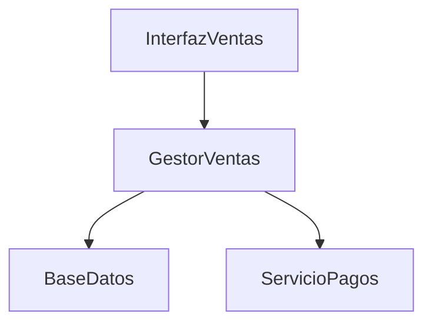

# ��️ Sistema de Ventas en Línea

## 🎯 Contexto y Problema

El comercio electrónico ha experimentado un crecimiento significativo, pero muchos negocios aún enfrentan desafíos en la gestión de sus ventas en línea. Los sistemas actuales suelen ser complejos y difíciles de mantener, lo que afecta la experiencia del usuario y la eficiencia operativa.

### ⚠️ Desafíos del Proyecto

| Desafío | Descripción |
|---------|-------------|
| Catálogo | Gestión de productos y categorías |
| Carrito | Manejo del carrito de compras |
| Pagos | Procesamiento de pagos seguros |
| Inventario | Control de stock en tiempo real |
| Pedidos | Gestión de pedidos y envíos |

## 🎯 Objetivo

Diseñar un sistema de ventas en línea que permita a los usuarios explorar productos, realizar compras y gestionar sus pedidos de manera eficiente y segura.

## 📋 Escenario

Se debe desarrollar un sistema de ventas con las siguientes funcionalidades principales:

1. **📦 Catálogo de Productos**  
   Explorar y buscar productos por categoría.

2. **🛒 Carrito de Compras**  
   Agregar y gestionar productos en el carrito.

3. **💳 Proceso de Pago**  
   Realizar pagos de forma segura.

4. **📝 Gestión de Pedidos**  
   Seguimiento y gestión de pedidos.

5. **👤 Perfil de Usuario**  
   Gestión de información personal y preferencias.

## 📝 Tareas

### Parte 1: Análisis (M3)

#### 1. Diagrama de Casos de Uso
- [ ] Crear diagrama UML de casos de uso para las funcionalidades principales
- [ ] Incluir actores (Cliente, Administrador)
- [ ] Seguir estándares de notación UML

#### 2. Diagrama de Clases
- [ ] Identificar y definir clases con estereotipos (Borde, Entidad, Control)
- [ ] Clases requeridas:
  - `Producto`
  - `Carrito`
  - `Pedido`
  - `Usuario`
  - `Pago`
  - `GestorVentas`
- [ ] Incluir atributos y métodos
- [ ] Definir asociaciones entre clases

#### 3. Diagramas de Interacción
- [ ] Diagrama de secuencia para "Realizar una Compra"
- [ ] Diagrama de colaboración para el mismo caso

#### 4. Tarjetas CRC
Para cada clase:
- [ ] Nombre
- [ ] Descripción
- [ ] Estereotipo
- [ ] Atributos
- [ ] Responsabilidades
- [ ] Colaboraciones

### Parte 2: Diseño (Módulo 3 - Lectura 3)

#### 1. Diagrama de Clases Refinado
- [ ] Tipos de datos específicos
- [ ] Firmas de métodos
- [ ] Nuevas clases o relaciones
- [ ] Consideraciones de rendimiento

#### 2. Decisiones de Diseño
- [ ] Estrategia de gestión de carrito
- [ ] Manejo de pagos
- [ ] Sistema de notificaciones

### Parte 3: Implementación (Módulo 4 - Lecturas 1, 2)

#### 1. Diagrama de Componentes
Componentes principales:

#### 2. Diagrama de Despliegue
Nodos:
- [ ] Servidor Web
- [ ] Servidor de Aplicación
- [ ] Servidor de Base de Datos
- [ ] Servidor de Pagos

### Parte 4: Pruebas (Módulo 4 - Lecturas 3, 4)

#### 1. Plan de Pruebas
Niveles:
- [ ] Unitaria
- [ ] Integración
- [ ] Sistema
- [ ] Aceptación

Casos de prueba requeridos:
1. ✅ Compra exitosa
2. ❌ Intento de compra sin stock
3. ⚠️ Modificación de carrito
4. 🚫 Cancelación de pedido

#### 2. Estrategia de Pruebas
- [ ] Frecuencia de ejecución
- [ ] Herramientas
- [ ] Criterios de finalización
- [ ] Recursos necesarios

## 📦 Entregables
1. Archivo .puml con el código de los diagramas
2. Imagen .png de cada diagrama generado
3. Explicación de los estados posibles de un pedido y sus transiciones

## 📌 Notas
- Fecha de entrega: [Fecha a definir]
- Puntos: 15

---
*Nota: Este documento está en formato Markdown y puede ser visualizado en cualquier editor que soporte Markdown para una mejor experiencia de lectura.* 